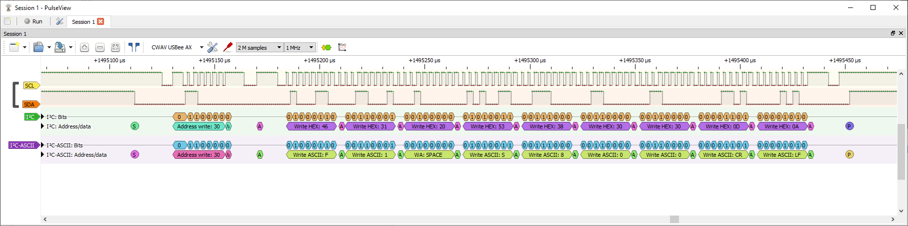

# PulseView Decoder I2C-ASCII

**i2c-ASCII** is a copy of **i2c** with a little different output.

**The difference is:**

    If the HEX value is between 0 and 127. then the ASCII charecter for that value will be shown.

I use both decoders at the same time.

To install the decoders just place the two folders:

    `i2c-ASCII`

    `i2c`

    into the `decoders` folder of your PulseViews instalation.

    Somthing like:

        `C:\Program Files\sigrok\PulseView\share\libsigrokdecode\decoders`

*Also in this repositry is a copy of the original i2c decoder. I have changed the wording of the output to match my modified version.*
